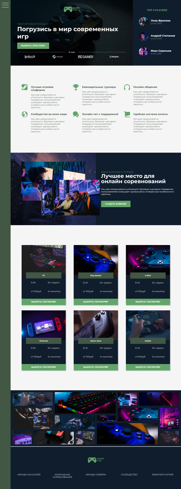

# Store-game

---

Данный лендинг разрабатывался на одном из прошедших мной курсов на образовательной платформе Stepik.

## Используемые технологии
* __HTML__
* __CSS__
* __SASS__.

Сайт полностью построен на сетке __Grid__. 

Для сборки проекта использовался Gulp. Ознакомиться со сборкой Gulp, которую я использую в своих проектах - можно [здесь](https://github.com/StolbunN/GULP-Starter).

## Возможные изменения

В дальнейшем планируется доработать лендинг, а именно переделать анимацию с использованием __JavaScript__.